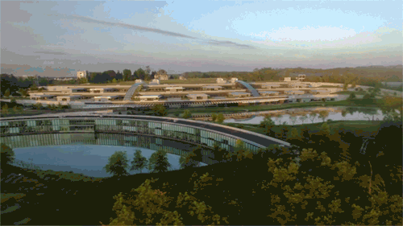

In an effort to update the orientation process for new employees at Janelia Research Campus, a small subset of Howard Hughes Medical Institute's Communications department (including myself) commissioned and produced a 20-minute internal video relaying the mission and cultural values upheld at Janelia.

I drafted the initial cast list for interviews, sifting through a list of 800+ "Janelians" to find a variety of faces to represent the campus. My team mates and I compiled a list of the main points on the mission we found to be of high priority, based off a 2013 speech by the Janelia Executive Director that was previously shown at orientations, through 2016.

After finalizing the cast list, I oversaw the production process in collaboration with my team mates and an external film crew. I appear in a cameo in the film, as does my voice in its introduction.

The video has been implemented in new HHMI Janelia orientations as of January 2017.

*note: I am happy to share this video as a portfolio piece with prospective employers.*
