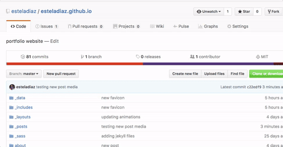
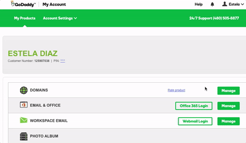
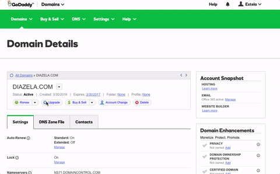

This website is up and running, thanks in large part to GitHub Pages and hours of googling. No *one* tutorial that I tried gave me a complete picture. Hence, here is my version of events that led to the successful hosting of my [esteladiaz.github.io](https://github.com/esteladiaz/esteladiaz.github.io) repository (this website).

1. Upload all your desired website files to a GitHub repository, titled *name.github.io*. See more: [hosting with GitHub Pages](https://pages.github.com).
2. Buy a custom domain through a DNS provider. I chose [GoDaddy](https://www.godaddy.com/). *Web hosting is not necessary!*
3. Add a file to your *name.github.io* repository. Title this file **CNAME**, and type the domain name you have purchased. Commit your file.  
4. Go to your DNS provider -- in this example, [GoDaddy](https://www.godaddy.com/). Under "**My Products**", find "**Domains**". Click **Manage**, then your domain name.  
5. In your **Domain Details** page, find the **DNS Zone File** tab.  
6. There are three zone records that will need to be added. Two are under **A (Host)**. Click "**Add Record**" and input: 

| Host type    | Host   | Points To     | TTL         |
| ---------    | ------ | --------------| ------------|
| A (Host)     | @      | 192.30.252.153| 1 Hour      |
| A (Host)     | @      | 192.30.252.154| 1 Hour      |
| CNAME (Alias)| www    | name.github.io| Custom: 600s|

## That's it!
Save your changes, and wait up to 48 hours for your DNS zone records' changes to update. In the meantime, your website can be seen live at *name.github.io*.
