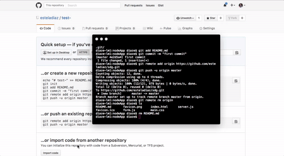
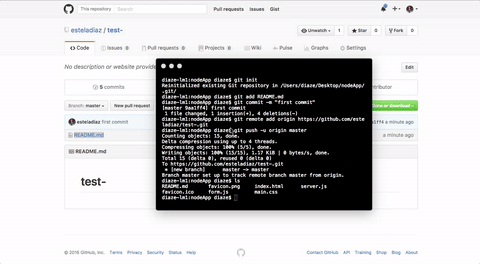

GitHub has a great MacOS application for organizing and collaborating on files, but I prefer to use the command line where I can. In my experience, instructions for how to push data to a GitHub repository can vary. To keep your files in a personal repository on GitHub and manage them with just a terminal, first, create a repository.

Upon creation, if you did not create a README.md file, the next page you see will include the following:

```
# this is a comment
# creates README.md file with your repository name in an h1 HTML tag
echo "# your-repository-name" >> README.md
# initializes github repository
git init
# add README.md to your working index (like a file queue)
git add README.md
# records changes to repository
git commit -m "first commit"
# associates your file directory with your online repository
git remote add origin https://github.com/your-username/your-repository-name.git
# push data to your repository
git push -u origin master
```

Open your terminal. Navigate to your desired directory, and copy the code GitHub gave you (the same as the above, but with your username and repository included).

Ensure you have Git:

```
git --version
```

Paste the code GitHub provided.


If you "ls" the files in your directory, you should have all your initial desired files listed, plus a README.md now. However, these are not on your GitHub repository -- yet.

My simple 4 steps to upload all directory files:

```
# add all files in directory to working index
git add .

# check the status of your working index
git status

# change repository records, and add a message for any contributors
git commit -m "changing something"

# push data to your repository
git push
```



If you return to your repository online, your new files should now be displayed.

I run these four commands to update any changes I make to this website, and whatever files I am working with. Without contributors, it works, and I haven't run into any obstacles.
